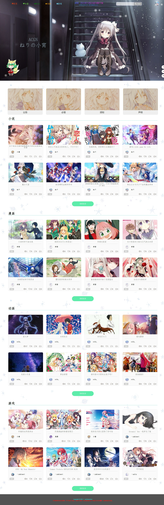
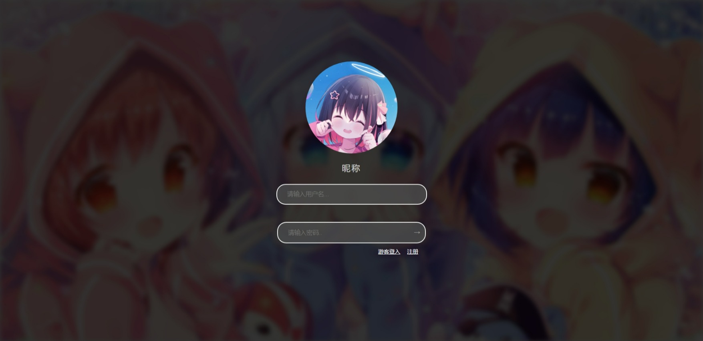
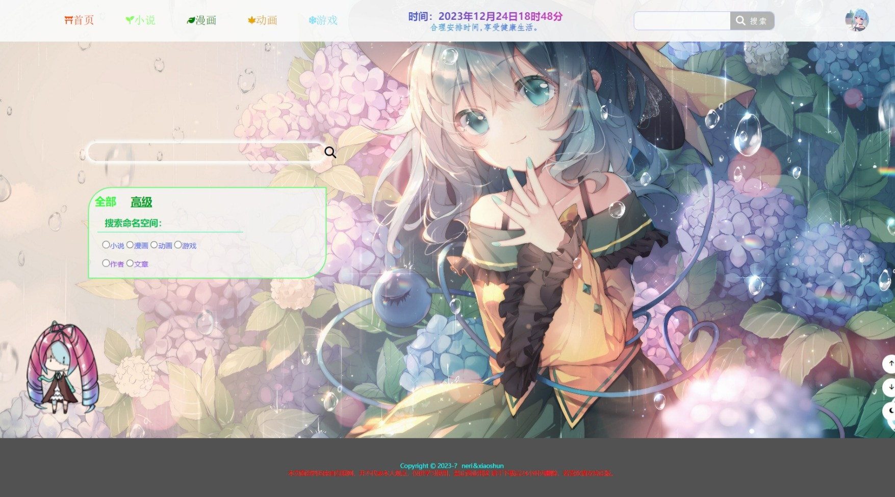
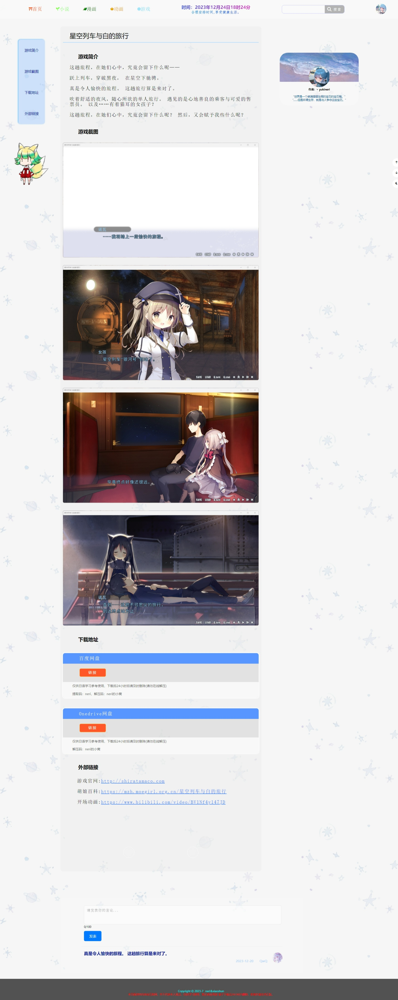
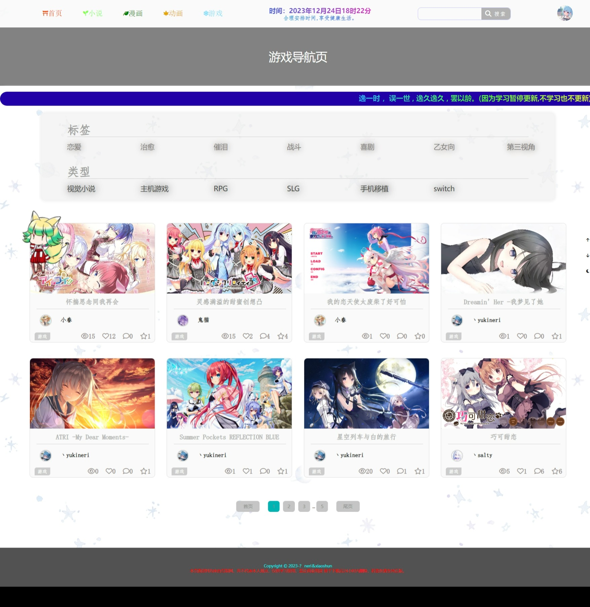
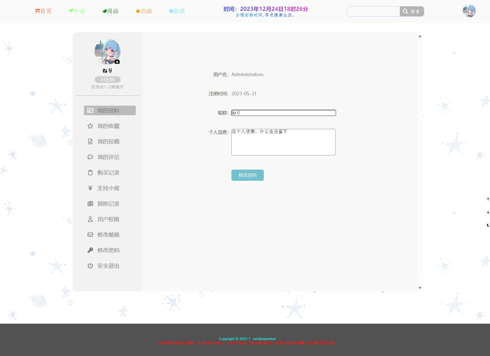
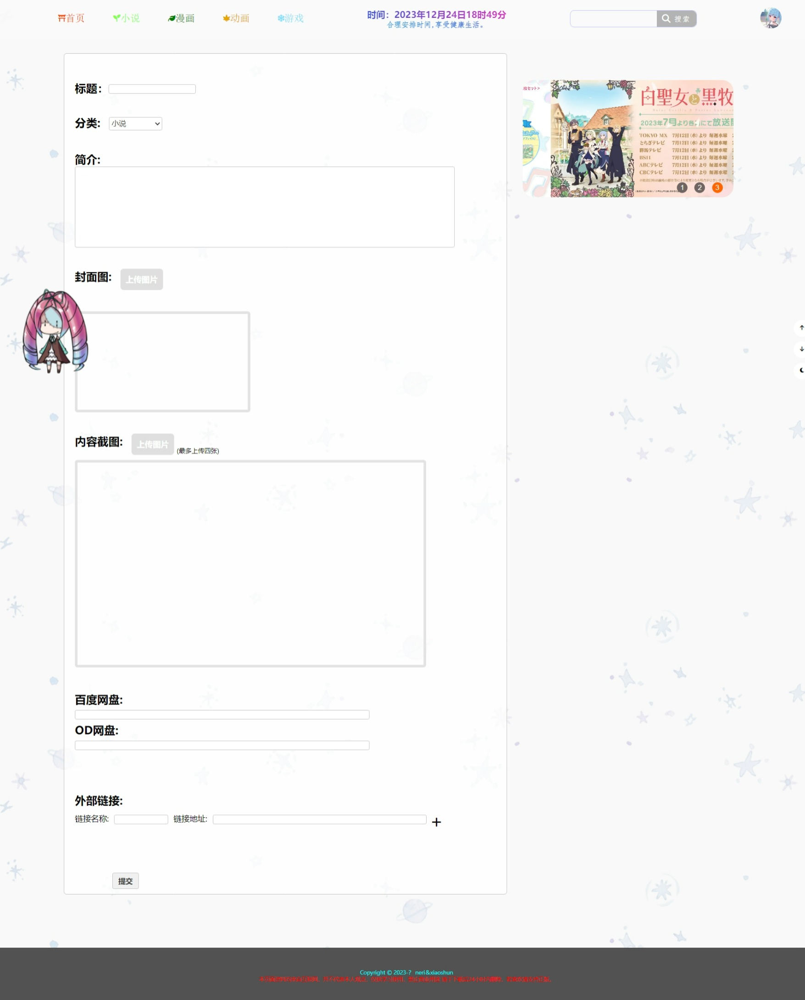

---
ねりの小窝
---
<section>ねりの小窝说明文档</section>

###前言

这是来自ねりの小窝提供的说明文档，里面包含使用方法和实现所需环境

php版本：8.2.0 mysql版本:8.0.31 Apache版本:2.4.54.2

###安装准备

①需要php环境,这里推荐安装wamp64。

②安装好后,检查服务启动是否正常,如未正常启动成功可尝试更换端口

③将neri.sql文件导入到mysql中,如用phpmyadmin导入,可能会因sql文件大于50MB导入失败,解决方法请参照<a>https://zhuanlan.zhihu.com/p/569402238</a>

④左键点击wanp64图标,在虚拟主机列表中,点击虚拟主机管理,添加虚拟主机,必填项主机名如：<path>www.neri.com</path>,虚拟站点目录请定位到neri 文件夹,如:<path>D:/example/neri/</path>

###使用说明

以上操作执行完毕后,可直接在浏览器中输入 <path>http://主机名:Apache端口号/</path>

例如:<path>http://www.neri.com:8080/</path>

###常见问题

①mysql连接失败的问题：用户名为root,密码为空,项目文件默认mysql端口号为3306,如端口号,mysql密码用户名为其他,请将<path>neri/php/link/public/mysql.php</path>文件下的

<path>$link = new mysqli('127.0.0.1','root','','neri的小窝',3306);</path>中进行更改

端口号可在 <path>wamp64图标>工具</path> 中查看

或者在mysql控制台中输入<path>show global variables like 'port';</path>查看

②login,submission页面注册上传图片卡住问题：php默认post请求不超过2M,上传图片文件过大时会请求失败导致注册上传失败</path>文件下的

可以在<path>wamp64/bin/php/选择启动的php版本/php.ini</path>php版本可在<path>左键wamp64图标>php图标版本号查看</path>中查看

在php.ini用ctrl+f进行搜索,将下列配置改成 
➢file_uploads = On（是否允许上传文件 On/Off 默认是On） 
➢upload_max_filesize = 2048M （上传文件的最大限制） 
➢post_max_size = 2048M （通过Post提交的最多数据） 

③关闭浏览器后,需要重新登录的问题：cookie过期为2小时，session过期默认为关闭浏览器后过期,不会报错,但要设置保存登录状态效果请更改php.ini(问题2中有对php.ini文件位置说明)中的配置

1、session.use_cookies
把这个的值设置为1,利用 cookie 来传递 sessionid 
2、session.cookie_lifetime
这个代表 SessionID 在客户端 Cookie 储存的时间（秒）,默认是0，代表浏览器一关闭 SessionID 就作废！ 那么我们把它设置为自定义如：86400 即 1 天。(单位秒) 
3、session.gc_maxlifetime
这个是 Session 数据在服务器端储存的时间,如果超过这个时间,那么 Session 数据就自动删除！也可以设置为 86400 即 1 天。(单位秒) 

④sql文件导入失败,排序规则不存在问题:因为sql版本低的问题,字符集不存在。

用记事本打开neri.sql文件,将sql文件的utf8mb4_0900_as_cs,utf8mb4_0900_ai_ci改成utf8mb4_general_ci,或者更低推荐使用utf8,且支持中文的字符集

④如遇到导入sql出现缺少正则表达式的问题：可以开启mysql控制台输入source D:/example/neri.sql命令导入sql数据库

⑤低版本php出现头像不能实时更新问题：php比8.2.0版本低的版本可能不支持函数定义两个返回值类型,7.4.2版本仅支持一个返回值类型

###项目作品图片展示

